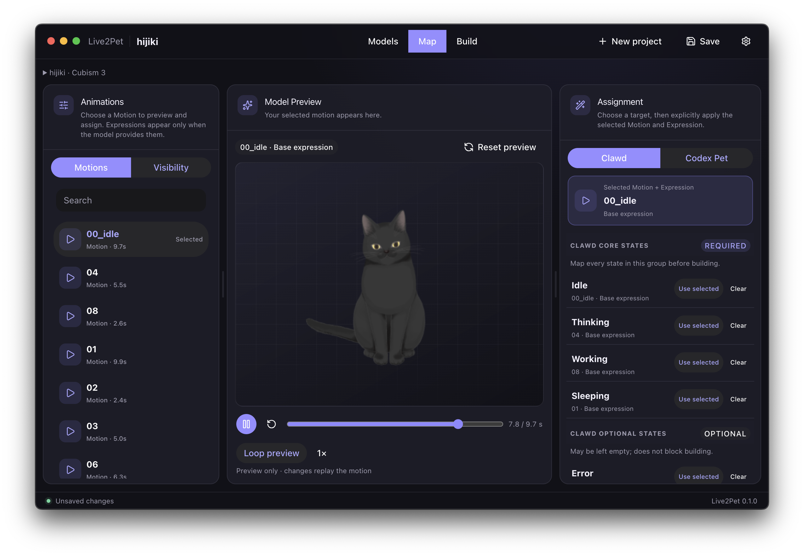

<h1 align="center">Live2Pet</h1>

<p align="center"><strong>Your favorite model. Your next desktop companion.</strong></p>
<p align="center">Turn Live2D and Spine animations into pets for Clawd on Desk and Codex.</p>

<p align="center">
  <a href="https://github.com/receyuki/live2pet/releases"></a>
  <a href="https://github.com/receyuki/live2pet/stargazers"></a>
  
  <a href="LICENSE"></a>
</p>
<p align="center">
  
  
  
  <a href="https://www.heroui.com/"></a>
</p>

<p align="center">
  <a href="README.md">English</a> · <a href="README.zh-CN.md">简体中文</a><br>
  <a href="#get-started">Get started</a> · <a href="docs/guides/user-guide.md">User guide</a> · <a href="https://github.com/receyuki/live2pet/issues">Feedback</a>
</p>

<p align="center"></p>

<p align="center"><sub>Browse → Preview → Map → Build. All on your computer.</sub></p>

## Contents

[Why Live2Pet](#why-live2pet) · [How it works](#how-it-works) · [Get started](#get-started) · [Compatibility](#compatibility) · [Runtimes](#runtime-setup) · [More](#more)

## Why Live2Pet

| | Make it yours |
| --- | --- |
| **Find your character** | Browse local model collections or GitHub folders. Download only the model you choose. |
| **See every motion** | Play, pause, scrub, and compare animations in a live preview. |
| **Keep the character, hide the clutter** | Identify parts with thumbnails and hide separable backgrounds or effects. |
| **One project, two destinations** | Assign animations to Clawd or Codex states, then build ready-to-import packages. |
| **Pick up where you left off** | Save projects, reuse runtimes, and work in English or Simplified Chinese. |

## How it works

1. **Choose a model** — drop a folder or supported PCK, or browse a GitHub collection.
2. **Make it your pet** — preview motions, hide unwanted parts, and assign pet states.
3. **Build and enjoy** — name your pet, choose quality, then save the ZIP or install it.

Your models stay local. Original source files stay unchanged.

## Get started

**macOS preview · source build available · public installers coming later.**

You currently need Git, Node.js 22.12+, and pnpm 11. Build the unsigned App:

```sh
git clone https://github.com/receyuki/live2pet.git
cd live2pet
corepack enable
pnpm install
pnpm --filter @live2pet/desktop package:mac
open apps/desktop/out/Live2Pet-darwin-*/Live2Pet.app
```

On first launch, add your runtime and choose a model. [Setup help and troubleshooting →](docs/guides/user-guide.md)

## Compatibility

| Bring in | Send to |
| --- | --- |
| **Live2D Cubism 2–5** model folders | **[Clawd on Desk](https://github.com/rullerzhou-afk/clawd-on-desk)** themes with transparent animated WebP |
| **Supported Live2D PCK** files | **Codex custom pets** with V2 sprite atlases |
| **Spine 4.0–4.3** folders, with an optional renderer | Save a **.live2pet** project to edit later |

Spine support is in preview; Windows is planned. PCK support depends on its contents and packaging. [Detailed support and limitations →](docs/guides/user-guide.md#compatibility)

<a id="runtime-setup"></a>

## Runtimes

**Add once. Reuse automatically.** Live2D runtime files are distributed separately under their own terms. Drop a downloaded runtime or extracted SDK folder into **Settings → Runtimes**.

| Your model | What to get |
| --- | --- |
| Cubism 3–5 | [Official Cubism SDK for Web](https://www.live2d.com/en/sdk/download/web/) → `Core/live2dcubismcore.min.js` |
| Cubism 2 | `live2d.min.js` from the [third-party legacy archive](https://github.com/dylanNew/live2d/tree/master/webgl/Live2D/lib) |
| Spine 4.0–4.3 | Click **Install** for the matching renderer in the App |

[Why a separate runtime? Setup details and licensing →](docs/guides/user-guide.md#runtimes)

## More

- **Using the App:** [User guide & FAQ](docs/guides/user-guide.md)
- **What's next:** [Issues](https://github.com/receyuki/live2pet/issues) · [V1 plan](docs/plans/live2pet-v1-implementation-plan.md)
- **Building together:** [Contributing](CONTRIBUTING.md) · [Developer guide](docs/guides/development.md)
- **Security:** [Report a vulnerability](SECURITY.md)

Built with Electron, React, TypeScript, and HeroUI. Licensed under [Apache-2.0](LICENSE).

<sub>Models and runtimes retain their own licenses. The preview image is illustrative; the pictured model is not included. See [third-party notices](NOTICE).</sub>
