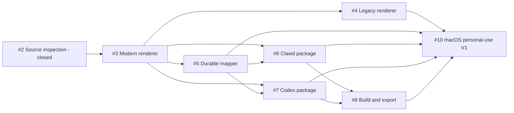

# Live2Pet Personal-Use V1 Implementation Plan

Status: Rescoped on 2026-09-01

## Outcome and boundary

The only current release outcome is a dependable personal-use macOS Desktop App that converts a permitted standard Live2D model or supported Destiny Child PCK into a previewed, validated, downloadable Clawd or Codex ZIP.

V1 does not wait for the official Cubism Web Framework integration, Codex skill/Mapper Session productization, Windows qualification, automatic installation, signing, notarization, or public binary distribution. Implemented seams for those capabilities stay in the codebase but do not expand the current acceptance path.

## Current baseline

The repository already contains:

- standard-folder and supported Destiny Child PCK inspection;
- versioned reference-only projects, recipes, separate target mappings, autosave, relinking, and review gates;
- Pixi-based modern and Cubism 2 adapters, runtime diagnosis/persistence, an isolated renderer realm, and App preview IPC;
- Clawd and Codex target validators and builders;
- transparent WebP/atlas generation, build progress, cancellation, reports, and bounded caches;
- generated target previews and artifact download handles;
- an Electron development shell and English/Simplified Chinese UI layer;
- CLI, installation, skill, Mapper Session, and official Framework bridge seams that are preserved but not required by this milestone; and
- release scans that exclude runtimes, models, copyrighted examples, and generated character packages.

The remaining work is primarily real-runtime acceptance and product-path hardening, not another architecture expansion.

## Prioritized delivery sequence

### P0 — Close the renderer acceptance gap

Issues: [#3](https://github.com/receyuki/live2pet/issues/3), [#4](https://github.com/receyuki/live2pet/issues/4)

Outcome: after a one-time runtime selection, modern and legacy inputs reopen and preview through the correct renderer without repeated setup or a crashed main window.

Work:

1. Make the App-managed runtime library the sole V1 setup path and automatically select saved runtimes by inspected Cubism generation.
2. Keep modern production rendering on the existing Pixi adapter with user-provided official Cubism Core.
3. Keep Cubism 2 on the isolated legacy adapter and qualify the locally owned Destiny Child fixture.
4. Complete Motion/Expression controls, full-bounds framing, renderer teardown, and actionable mismatch errors.
5. Hide or label the official Framework bridge experimental so it cannot confuse the V1 workflow.

Acceptance gate:

- one real standard modern model and the locally owned legacy PCK each pass import, reopen, preview, unload, and failure-recovery checks in the Desktop App;
- neither path asks for an already saved matching runtime again; and
- no runtime or model bytes appear in Git, project files, diagnostics, or outputs.

### P0 — Close the durable mapper gap

Issue: [#5](https://github.com/receyuki/live2pet/issues/5)

Outcome: a user can select one source Animation Recipe, assign it directly to either target, save the project, and resume without losing or silently changing mappings.

Work:

1. Finish the real Electron happy-path test for the three-column selection/preview/assignment flow.
2. Verify Motion-plus-Expression recipes, separate Clawd/Codex mappings, validation, undo/redo, keyboard operation, autosave, and explicit save/reopen.
3. Verify source relinking preserves stable identities and blocks changed identities pending review.
4. Remove any remaining duplicated selector or browser-only behavior from the required App path.

Acceptance gate:

- a real project saves and reopens with equivalent mappings and Render Presets;
- the right column always assigns the currently selected recipe; and
- no Source Package or runtime bytes are embedded.

### P0 — Prove both target packages in their hosts

Issues: [#6](https://github.com/receyuki/live2pet/issues/6), [#7](https://github.com/receyuki/live2pet/issues/7)

Outcome: both generated ZIP types pass internal validation, can be previewed from generated assets, and load in the pinned target host.

Clawd work:

1. Treat `idle`, `thinking`, `working`, and `sleeping` as the required V1 path.
2. Verify transparent WebP generation, `theme.json`, package-root shape, display size, and the 80-MiB rejection behavior.
3. Import one locally generated ZIP into the pinned Clawd version.
4. Keep advanced sleep, fallbacks, reactions, tiers, idle pools, and roam available but non-blocking.

Codex work:

1. Verify all nine mapped rows, exact atlas geometry, transparent unused cells, deterministic sampling, and manifest shape.
2. Verify contact sheet and true-size playback use the generated atlas.
3. Load one locally generated ZIP through the current Codex custom-pet workflow.

Acceptance gate:

- real imports succeed for both hosts;
- generated previews match the artifact rather than source playback; and
- any host mismatch is captured as a narrow compatibility fix, not a new framework project.

### P1 — Harden build, cache, progress, and download

Issue: [#8](https://github.com/receyuki/live2pet/issues/8)

Outcome: long builds are understandable, cancellable, reusable, and always end in a clear terminal state with a portable artifact.

Work:

1. Verify named stages, percentage progress, terminal success/failure/cancelled state, and build-control reset.
2. Keep renderer capture concurrency bounded; parallelize safe independent encoding/assembly only where measurements show a benefit.
3. Verify unchanged rebuilds use integrity-checked capture and WebP cache entries.
4. Verify cancellation and failure clean staging data and never expose a partial artifact.
5. Verify reports, path redaction, safe artifact naming, generated preview, and explicit ZIP download.
6. Keep existing install code covered by unit tests but remove installation and a 5-GiB cache policy from V1 acceptance.

Acceptance gate:

- both targets finish with a visible terminal state and downloadable ZIP;
- a cancelled build can be followed immediately by a successful build;
- an unchanged rebuild reports cache hits and avoids equivalent capture work; and
- builds do not install or overwrite artifacts implicitly.

### P1 — Package and accept the personal-use macOS App

Issue: [#10](https://github.com/receyuki/live2pet/issues/10)

Outcome: the user can launch a local macOS App and complete the entire workflow without development commands after the App has been built.

Work:

1. Produce and smoke-test the current-machine macOS App bundle with packaged mapper assets and native image dependencies.
2. Run the modern, legacy, both-target, cancellation, restart, and runtime-reuse acceptance scenarios from the V1 specification.
3. Complete the required English/Chinese, keyboard, progress-announcement, and error-state review.
4. Run dependency, source-release, path/privacy, and excluded-asset scans.
5. Write a short personal-build/run guide that clearly separates local use from public signed binary release.

Acceptance gate:

- a clean macOS user profile completes import through ZIP download for both targets;
- no system codec tool is required;
- all P0/P1 issues are closed with test or manual acceptance evidence; and
- the public binary release gate remains explicitly separate.

## Dependency graph

[#9](https://github.com/receyuki/live2pet/issues/9) and [#11](https://github.com/receyuki/live2pet/issues/11) are post-V1 and are not on this dependency graph.

## Issue status policy

| Issue | V1 role | Close when |
| --- | --- | --- |
| #2 Source inspection | Complete | Already closed |
| #3 Modern preview | P0 | Real modern model passes saved-runtime App preview |
| #4 Legacy preview | P0 | Locally owned PCK passes isolated App preview |
| #5 Durable mapper | P0 | Save/reopen and real Electron mapping path pass |
| #6 Clawd package | P0 | Core-state ZIP imports into pinned Clawd |
| #7 Codex package | P0 | Nine-row ZIP loads in Codex |
| #8 Build/export | P1 | Progress, cancel, cache, preview, and download pass |
| #10 macOS V1 | Final | Clean-profile full workflow passes |
| #9 Codex skill/session | Post-V1 | Reprioritize after V1 feedback |
| #11 Windows x64 | Post-V1 | Reprioritize after macOS V1 |

An issue closes when its observable acceptance evidence exists, even if optional polish or post-V1 capability remains. Follow-up work becomes a narrower issue instead of keeping a broad issue open indefinitely.

## Verification matrix

| Surface | Automated evidence | Local acceptance evidence |
| --- | --- | --- |
| Source inspection | Synthetic standard/PCK contracts and malformed-input tests | Owned modern model and Destiny Child PCK |
| Runtime library | Validation, persistence, generation selection, clear/replace tests | Restart and reopen without reselection |
| Renderer | Shared deterministic contract and realm teardown tests | Motion/Expression playback on both generations |
| Project/mapper | Schema, save/recovery, relink, mapping validation tests | Electron save/reopen and keyboard flow |
| Clawd | Synthetic manifest/WebP/size/package validation | Import into pinned Clawd version |
| Codex | Synthetic atlas/manifest/transparency validation | Load through current custom-pet workflow |
| Build service | Progress, cancel, cache, path-redaction, artifact tests | Repeat build and ZIP download |
| macOS App | Bundle launch and packaged-dependency smoke | Clean-profile end-to-end run |

## Deferred backlog

- [#9](https://github.com/receyuki/live2pet/issues/9): Codex skill, installed-CLI product surface, and authenticated Mapper Session.
- [#11](https://github.com/receyuki/live2pet/issues/11): Windows x64 qualification.
- Official Cubism Web Framework production adapter.
- Automatic Clawd/Codex installation as the primary workflow.
- Public signed/notarized installers and update channel.
- Large configurable cache policy and cache-management UI beyond current bounded controls.
- Advanced Clawd behavior as mandatory target-host acceptance.

## Definition of done for V1 implementation issues

1. The issue stays within the V1 scope above.
2. Observable acceptance criteria are covered by automated tests where practical.
3. Any real-runtime or target-host evidence is recorded without committing proprietary inputs.
4. `pnpm test`, `pnpm typecheck`, and `pnpm release:check` pass for implementation changes.
5. English documentation and affected Simplified Chinese UI messages are updated.
6. No runtime, model, generated character package, secret, token, or unrelated absolute path is introduced.
7. The Issue body and native GitHub dependencies match the actual remaining work.
