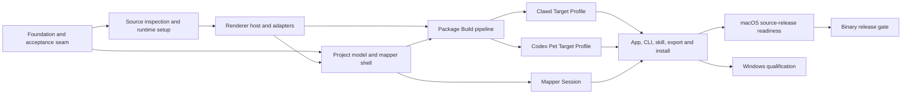

# Live2Pet V1 Implementation Plan

Status: planning complete; WP1 source-inspection/runtime-settings and WP4 cache slices implemented; the Cubism 2 legacy contract is now opt-in qualified; implementation continues in dependency order

This plan turns the accepted architecture decisions and the V1 product specification into an executable delivery sequence. It is intentionally more operational than the ADRs and less repetitive than the specification.

## Planning hierarchy

- `CONTEXT.md` defines the domain language used by the App, CLI, skill, and issues.
- `docs/adr/` records decisions that implementation must respect unless an ADR is explicitly superseded.
- `docs/specs/live2pet-v1.md` defines the complete V1 behavior and acceptance scope.
- This document defines work packages, dependencies, delivery gates, and verification.
- GitHub issues are the assignable units of work derived from this plan. An issue is marked `ready-for-agent` only when its dependencies and acceptance checks are concrete.

## Current baseline

The repository currently contains three proven but production-incomplete paths:

- a browser mapper that loads a Live2D model, previews discovered Motions, and records Clawd-oriented Motion Mappings;
- a frame-export process that renders transparent frames from one Motion; and
- a Destiny Child PCK extractor for the tested uncompressed and unencrypted container layout.

These prototypes establish feasibility. They do not yet provide the complete Live2Pet Project workflow, shared application services, target-correct final previews, package validators, a stable CLI protocol, a distributable App, or full automated tests. Production work should capture their behavior through the public acceptance seam before replacing their duplicated logic.

The first WP1 source-inspection slice is now captured in `packages/source-inspector/`: its public CLI and browser mapper use the same versioned normalized-manifest shape for standard directories and the supported uncompressed, unencrypted Destiny Child PCK layout. The initial reference-only Project schema is also captured in `packages/project/` with validation, deterministic serialization, and atomic file I/O. The runtime setup seam in `packages/runtime/` now discovers and validates user-provided modern or legacy JavaScript runtime entrypoints without exposing absolute paths in diagnostics. The renderer contract, deterministic synthetic implementation, RGBA motion-candidate sampling, temporary Pixi/Cubism browser bridge, automatic Cubism-generation adapter selection, restartable isolated renderer-realm host, strict CSP/window defaults, narrow typed renderer IPC helpers, and a loopback-confined Source Package/runtime asset server are captured in `packages/renderer/`, deterministic motion-aware candidate deduplication and frame selection are captured in `packages/frame-selection/`, guide-aligned Clawd Target Profile rules and Clawd package validation are captured in `packages/clawd-target/`, Codex Pet V1 atlas/mapping rules, fixed transparent-cell layout planning, RGBA composition, and Codex package validation are captured in `packages/codex-target/`, and the cancellable Package Build service now covers Codex atlas encoding plus guide-shaped Clawd theme encoding, size checks, zip.js archive creation, and an integrity-checked bounded disk cache in `packages/package-build/`. A stable JSON `live2pet` CLI now provides one umbrella protocol over inspection, runtime diagnosis, project validation, ZIP package validation, and bounded-cache status/clear operations in `packages/cli/`. `packages/mapper-session/` now provides a loopback-only, token-authenticated, short-lived in-memory project session for the shared mapper host. The browser mapper exercises a nine-row Codex mapping and Canvas WebP → zip.js build path without runtime CDN loading: modern Core can be selected locally, while Cubism 2 preview requires an explicitly selected local legacy runtime. The desktop Mapper now exposes a shared-App Clawd Theme ZIP path that captures mapped Motion frames, produces a guide-shaped `theme.json`, validates the package, returns an explicit artifact download handle, and previews generated WebP assets by state or reaction. It also ships the first English/Chinese i18n key layer and locale selector. Full official modern Web Framework support, target behavior simulation, and platform packaging remain downstream.

The headless CLI now supports portable export and explicitly authorized installation through the conflict-aware `packages/installation/` service; the installation package resolves documented Clawd/Codex user-data roots on macOS, Windows, and Linux when an explicit target root is not supplied.

The project service now also provides explicit autosave recovery, source relinking, and review gating when a source fingerprint changes. The shared Mapper now connects those operations to a bounded browser-profile draft, dirty-state/exit protection, an explicit recovery action, a source-review panel, and build-readiness gates; the future Electron host can move the same reference-only draft envelope to its project service. The desktop shell now has a repeatable `prepare:mapper` staging step that rewrites workspace-relative browser dependencies into a local bundle for future packaging; Core and legacy runtimes remain user-provided. The App host now persists runtime paths and fingerprints under user data without exposing paths or bytes over IPC, and the Mapper reports a selected runtime to that service when a local file path is available.

### Current implementation update (2026-08-31)

The Mapper now exposes a shared-App Clawd Theme ZIP path that captures mapped Motion frames, produces a guide-shaped `theme.json`, validates the package, returns an explicit artifact download handle, and can preview generated Clawd WebP assets by state or reaction from that artifact. It also ships the first English/Chinese (`zh-CN`) i18n key layer and locale selector. Browser-only sessions keep the Clawd build action disabled because they do not provide the trusted shared encoder; full target behavior simulation and installation remain downstream. The Cubism 2 renderer boundary is now explicit (`LegacyPixiLive2dAdapter`), preserves legacy Expression indexes, and has an opt-in Puppeteer contract test that rendered the local `c311_02` Destiny Child fixture with a user-provided `live2d.min.js`; no fixture or runtime is checked in. Adapter selection now follows the inspected Cubism generation, and the desktop shell has a restartable isolated renderer-realm host with a loopback asset server, fixed-function `webContents` bridge, strict CSP bootstrap page, failure teardown tests, and a user-facing one-session preview control for standard local directories. PCK resources remain in the browser's reconstructed preview; the official modern Web Framework adapter remains open.

## V1 success definition

V1 is complete when all of the following are observable on a clean supported macOS system:

1. A user can install or locally build the App without installing FFmpeg, ImageMagick, libwebp commands, or a system ZIP tool.
2. A user can configure a compatible, officially downloaded Cubism runtime without rebuilding Live2Pet.
3. The App can inspect and preview a standard modern Cubism Source Package and the tested Destiny Child legacy PCK path.
4. The user can create Animation Recipes, separately map Clawd and Codex behavior slots, save a `.live2pet` project, close the App, and resume later.
5. The same project can build, validate, preview, and export both a Clawd Theme Package and a Codex Pet Package.
6. A Package Build never silently crops a model, changes a selected Render Preset, overwrites an artifact, installs a package, or uploads source data.
7. The installed Codex skill can perform headless operations through the same CLI and can open the shared visual mapper through a protected Mapper Session.
8. Public CI passes with synthetic fixtures and no Cubism Core, copyrighted character asset, or generated example package.
9. The public source tree contains the required license and notices and passes the source-release checklist.
10. Official installers remain unpublished until the separate Live2D binary-release gate is cleared.

## Dependency map

Clawd and Codex target work can proceed in parallel after the shared Package Build pipeline is stable. Mapper Session security can proceed alongside target work after the project operations and shared mapper shell exist. Windows qualification is deliberately downstream of product behavior, but platform-neutral code and tests are required from the first work package.

## Work packages

### WP0 — Baseline capture and workspace foundation

Objective: establish the production repository shape and the single external test seam before migrating prototype behavior.

Deliverables:

- pnpm workspace with Electron Forge, React, TypeScript, shared domain modules, and a versioned CLI protocol;
- schemas for Source Package inspection results, Animation Recipes, Motion Mappings, Target Profiles, Package Builds, Live2Pet Projects, Pet Packages, progress events, and typed errors;
- a copyright-safe synthetic source adapter and deterministic RGBA test renderer;
- the end-to-end harness that drives the public CLI and Mapper Session boundary; and
- characterization checks for the prototype's Motion discovery, mapping export, transparent frame output, and tested PCK extraction behavior.

Exit gate:

- one test can create a synthetic project, invoke a placeholder Package Build through the public boundary, and inspect a deterministic result;
- Electron boots a sandboxed shared UI in a smoke test;
- all public schemas are versioned and reject unknown incompatible major versions; and
- CI contains no proprietary runtime or model data.

### WP1 — Source inspection, fingerprints, and runtime setup

Objective: normalize supported inputs and make runtime availability an explicit, diagnosable precondition.

Deliverables:

- standard Cubism directory inspection for Cubism 2 `model.json` and Cubism 3+ `.model3.json` layouts;
- hardened support for the tested uncompressed and unencrypted Destiny Child PCK shape;
- normalized resource identities, Motion and Expression catalogs, warnings, and deterministic source fingerprints;
- runtime selection, compatibility validation, version detection, restart-required behavior, and CLI diagnosis; and
- cache-contained PCK extraction with entry, size, range, collision, and traversal protections.

Exit gate:

- synthetic valid and invalid directory fixtures produce typed, deterministic inspection results;
- malformed PCK cases cannot write outside the cache or consume unbounded resources;
- an absent or incompatible runtime produces actionable App and CLI errors; and
- no runtime bytes or absolute paths appear in a project, report, diagnostic bundle, or test snapshot.

### WP2 — Sandboxed renderer host and renderer adapters

Objective: provide one renderer contract for interactive preview and deterministic capture while isolating third-party runtime code.

Deliverables:

- sandboxed render-window host with Node integration disabled, context isolation, strict CSP, and narrow typed IPC;
- shared renderer contract for load, unload, Motion playback, Expression control, loop, speed, bounds analysis, deterministic stepping, and RGBA capture;
- official Cubism Web Framework adapter for Cubism 3, 4, and 5 (the current temporary Pixi/Cubism browser bridge is an integration seam, not the final adapter); and
- a time-boxed Cubism 2 compatibility spike followed by the replaceable `LegacyPixiLive2dAdapter`; its opt-in contract test runs only with user-provided runtime/source paths.

Exit gate:

- the deterministic renderer passes the contract suite in CI;
- a user-provided modern runtime and local fixture pass the opt-in contract suite on macOS;
- the tested Destiny Child fixture passes the legacy suite when the opt-in local runtime/source variables are provided; and
- model or renderer failure destroys the isolated realm without terminating the main App.

### WP3 — Live2Pet Project and shared mapper

Objective: make mapping durable, recoverable, target-specific, and usable from Electron or Codex.

Deliverables:

- versioned `.live2pet` serialization, migration framework, atomic save, recent projects, dirty state, and autosave recovery;
- reference-based source path and fingerprint handling with relink, stable-identity preservation, and mandatory review after changed dependencies;
- reusable Animation Recipes containing one Motion and an optional Expression;
- separate Clawd and Codex Motion Mappings with immediate validation;
- the three-column React mapper with search, playback controls, recipe assignment, keyboard alternatives, undo/redo, and unsaved-change protection; and
- distinct source preview and generated target-preview surfaces.

Exit gate:

- a synthetic project survives save, close, reopen, migration, source move, and relink without embedding assets;
- a changed Motion or Expression blocks Package Build until the affected mapping is reviewed;
- every mapping operation is available without drag-and-drop; and
- the same mapper test suite runs against its Electron and Mapper Session hosts without duplicating domain logic.

### WP4 — Deterministic Package Build pipeline

Objective: create the one orchestration path used by the App, CLI, skill, and all Target Profiles.

Deliverables:

- ordered inspect, validate, bounds, render, sample, encode, assemble, validate, preview, package, and report stages;
- cancellable progress events and typed failures;
- `sharp` image processing and transparent animated WebP encoding;
- `@zip.js/zip.js` archive handling;
- a bounded 5-GiB LRU cache keyed by source, runtime, renderer, recipe, target version, and Render Preset;
- integrity-checked reuse and cleanup of partial staging data; and
- sanitized build reports and collision-safe artifact naming.

Current slice: `packages/package-build/src/cache.cjs` provides the bounded LRU cache, atomic writes, SHA-256 integrity checks, project/source filtering, status reporting, and clear operations. `buildProjectTargets` now drives the existing Clawd/Codex builders from one validated Project, can capture mapped Motions through the shared renderer contract when pre-captured inputs are absent, applies named target-owned Render Presets selected by the Project, reuses verified candidate frames and encoded WebP assets when complete source/runtime/renderer/encoder context is supplied, records path-free build provenance, emits concise path-free build reports and generated-asset target preview plans, validates each generated target before packaging, and derives safe artifact filenames containing package id, target, and semantic version. Both target builders now expose explicit `preview` and `report` progress events around those outputs, so App, CLI, and future skill hosts can render the same observable stage timeline. The Desktop App capture path now uses deterministic fixed-step sampling, reusable capture surfaces, bounded stacked RGBA transport, and an App-private capture cache keyed by source/runtime/renderer/recipe/target/preset; repeat Clawd builds can skip Live2D capture entirely. App preview integration and the end-to-end safety seam remain to be completed. Cache reuse is deliberately opt-in until the caller supplies the actual runtime, renderer, and encoder versions.

Exit gate:

- identical recorded inputs produce the same selected frames, geometry, metadata, and package inventory;
- cancellation leaves no partial package and reuses only verified cache entries;
- cache hits, invalidation, accounting, and clearing are externally observable and tested;
- package and report scans find no bearer token, runtime bytes, or absolute source path; and
- packaged macOS execution loads `sharp` and writes WebP and ZIP output without machine-installed helper tools.

### WP5 — Clawd Target Profile

Objective: build packages that follow a pinned Clawd theme contract and cover the selected animation-capability subset.

Deliverables:

- versioned target schema for core states, direct/full sleep, common optional states, allowed fallbacks, reactions, idle pool, working tiers, juggling tiers, and roam;
- Compact, Balanced, and High Render Presets plus Small, Standard, and Large display presets with Large as default;
- transparent static or animated WebP assets and generated theme metadata;
- generated-state preview that simulates final timing, loop, fallback, sleep, tier, reaction, and roam behavior;
- schema, asset, alpha, animation, package-root, and size validators; and
- blocking behavior at 83,886,080 bytes with a per-asset size report and no silent re-encoding.

Exit gate:

- direct-sleep and full-sleep synthetic projects both build and import in the pinned Clawd version;
- every supported fallback and reaction path is covered by the acceptance seam;
- unsupported capabilities are omitted rather than advertised; and
- oversized output fails before export with enough information to choose a lower Render Preset.

Current slice: `packages/clawd-target/` now validates guide-shaped theme manifests, state/reaction bindings, fallbacks, referenced WebP assets, and the 80-MiB size limit. It is exercised against a real Sharp/zip.js Clawd build; richer user-authored configuration, install UX, and clean-machine acceptance remain.

Current implementation update: the App-host seam now exercises a synthetic Clawd build end to end, and Mapper can preview generated WebP state/reaction assets with manifest fallback resolution. The Package Build preview now also models the guide's idle pool, working/juggling tier selection, direct/full sleep transitions, reactions, and free-roam fallback/orientation semantics; generated themes derive baseline tier metadata from mapped `working`, `juggling`, and `roam` Motions and validate every referenced behavior asset. The Mapper now persists selected local runtime source text in a bounded browser-profile store and restores it at startup; its strict-CSP Pixi preview uses the version-matched `@pixi/unsafe-eval` static uniform uploader and allows only generated `blob:` resource URLs. Users can now add selected Motions to Clawd idle pools and working/juggling tiers, edit tier thresholds or idle durations, and opt into roam asset mirroring; those references are captured, converted to generated asset names, and persisted in `.live2pet` projects. The remaining WP5 work is install UX and real clean-machine acceptance.

### WP6 — Codex Pet V1 Target Profile

Objective: build an official-contract Codex custom pet from Live2D Motions without compromising full-body readability.

Deliverables:

- all nine official V1 behavior slots and default timing/fallback data;
- deterministic motion-aware candidate analysis and ordered frame selection;
- 1536-by-1872, 8-by-9 atlas assembly with 192-by-208 cells and normalized transparent unused cells;
- target presets that vary sampling and supersampling cost without altering final geometry;
- full-body motion bounds, high-quality downsampling, contact sheet, and true-size row playback; and
- manifest, atlas, alpha, occupancy, frame-range, and package validators.

Exit gate:

- the acceptance seam verifies exact geometry and default distinct-frame counts for all nine rows;
- unused cells are fully transparent and no rendered pixel crosses a cell boundary;
- selected frames are deterministic, ordered, preserve endpoints and major motion extrema, and keep the full character visible; and
- the generated package loads through the current documented Codex custom-pet installation flow.

Current slice: `packages/codex-target/` now validates the official `pet.json` fields, exact atlas geometry, static WebP dimensions, package inventory, and byte-level WebP headers. It is exercised against a real Sharp/zip.js Codex build. The generated preview contract exposes the 192 × 208 final cell size, and the Mapper can play each captured atlas row at that target size after a build; installation and host-compatibility acceptance remain.

### WP7 — CLI, Codex skill, Mapper Session, export, and installation

Objective: expose the same product behavior safely through every supported entry point.

Deliverables:

- stable JSON CLI operations for diagnosis, inspection, project work, validation, Package Build, export, explicit installation, cache management, Mapper Sessions, and skill management;
- App-installed Codex skill with protocol compatibility checks;
- loopback-only, token-authenticated, short-lived Mapper Session with one-project allowlisting and Origin validation;
- portable export for both Target Profiles;
- explicit, staged installation with cancel-by-default conflict handling, side-by-side ids, recoverable upgrade, and rollback; and
- platform path adapters for Clawd and Codex user data.

Exit gate:

- App and skill builds of the same project traverse the same Package Build service and produce equivalent validated artifacts;
- wrong, missing, expired, or cross-origin Mapper Session credentials are rejected;
- the session cannot read an unrelated path or execute a general command;
- build and export never install implicitly; and
- simulated upgrade failure restores the prior installed package.

Current slice: `packages/cli/` exposes stable JSON operations for version, source inspection, runtime diagnosis, project validation/recovery, shared Package Build from a transient pre-captured input spec, ZIP package validation, portable export, explicit installation, skill status/install, and bounded-cache status/clear. `packages/source-inspector/` now optionally persists a normalized manifest and PCK-derived resources as one integrity-checked entry in a caller-owned bounded cache; the App and CLI both use the same inspector contract, while inspection responses remain binary-free and path-redacted. `packages/mapper-session/` provides the authenticated loopback session, a token-hiding typed client, and a bounded host helper that serves a caller-provided Mapper document, snapshots an optional allowlisted staged asset bundle, creates a token-free launch descriptor, and performs one-time fragment bootstrap for file or loopback browser hosts. `packages/app-host/` defines the Electron-ready typed main/preload boundary for source inspection, runtime and skill provisioning, starting, reading, updating, and closing one Mapper Session and, when the main process injects the shared services, routing binary-free build/install summaries with versioned progress events and short-lived artifact handles retrievable through an explicit `getBuildArtifact` call. Skill installation accepts only explicit confirmation and keeps destination paths and text contents in the main process. `apps/desktop/` now provides a minimal Electron 44 development shell that pins the Mapper document, resolves a staged Mapper and text-only skill bundle from `process.resourcesPath` for packaged builds, passes the packaged bundle as the host's bounded asset root, rejects renderer requests from unknown senders, denies new windows and renderer navigation, rejects webviews and permissions, and exposes only that typed IPC boundary. Its `prepare:mapper` script stages pinned Pixi, pixi-live2d-display, and zip.js browser assets with hashes and license files while deliberately omitting Cubism Core and legacy runtimes; the Forge configuration records the skill resource path for the later packaging gate. `packages/installation/` provides archive extraction, conflict policy, atomic commit, rollback, and documented macOS/Windows/Linux target-root adapters. The Package Build CLI response is sanitized and can export safe versioned artifacts without implying installation. `packages/skill-client/` and `skills/live2pet/` provide the dependency-free Codex skill client/entrypoint with protocol-1 handshake, capability checks, safe argument construction, and explicit installation authorization; `packages/skill-manager/` validates and atomically installs the text-only skill bundle. Remaining App work is real Forge packaging, final target-host qualification, and selecting Forge makers once the source-release gates pass.

Current implementation update: the shared Mapper build controls now cover both Codex Pet and Clawd Theme artifacts, generated target previews are visible after successful builds, and the initial English/Chinese locale layer is wired into the UI without changing IPC or target schemas. Local runtime persistence, startup restore, a clear-saved action, bounded browser-profile project drafts, dirty-state/exit protection, source relinking review, pre-build review gates, explicit Desktop-App artifact installation controls, and Desktop-App Codex skill status/install controls are now part of the Mapper host. The Desktop App also supports an explicit native install-folder picker backed by short-lived opaque location ids, while default-root installation remains available; the remaining App work is real Forge packaging, final target-host qualification, and release readiness.

### WP8 — macOS hardening and source-release readiness

Objective: make V1 safe to publish as source and ready for a private or approved macOS installer.

Deliverables:

- macOS arm64 and x64 packaging smoke tests;
- keyboard, focus, status-announcement, error-association, and reduced-motion review;
- archive, IPC, CSP, path, logging, and privacy threat checks;
- English copy review and i18n key audit;
- Apache-2.0 license, third-party notices, dependency and native-binary inventory, security policy, contribution guidance, and release checklist; and
- automated scans that reject Core, model, example-theme, generated-character, token, and absolute-path leakage.

Current implementation update: the repository now carries an Apache-2.0 `LICENSE`, a project `NOTICE`, and `pnpm release:check`, which scans tracked and non-ignored source entries for copyrighted model/derived-package paths, runtime files, binary payloads, oversized release entries, and missing attribution files. The check reports the deliberately ignored local-input patterns without reading or publishing those files; clean-machine packaging and the external Live2D binary-release gate remain open.

Exit gate:

- a clean macOS test account can complete the V1 success workflow using a user-provided runtime and model;
- public CI passes using synthetic data only;
- the source archive passes license, secret, copyright, and ignored-file checks; and
- the release checklist clearly prevents official installer publication while the Live2D Expandable Application gate remains open.

### WP9 — Windows x64 qualification

Objective: deliver Windows support without changing the Live2Pet Project or Package Build contracts.

Deliverables:

- Windows-native Electron package and `sharp` binary handling;
- Windows path, cache, runtime-selection, Clawd install, and Codex install adapters;
- long-path, Unicode-path, locked-file, antivirus-interference, and atomic-replacement tests; and
- Windows x64 clean-machine smoke workflow.

Exit gate:

- the same synthetic acceptance seam passes on Windows x64;
- a user-provided runtime and permitted local model complete the real renderer smoke test; and
- packages created on macOS and Windows validate to the same target contracts.

## Proposed issue map

The V1 specification is published as [GitHub Issue #1](https://github.com/receyuki/live2pet/issues/1). Its implementation is decomposed into the following approved tracer-bullet sub-issues. GitHub native sub-issue and blocked-by relationships are authoritative; the dependency column is retained for readable planning context.

| Issue | Tracer-bullet ticket | Blocked by | What becomes demonstrable |
| --- | --- | --- | --- |
| [#2](https://github.com/receyuki/live2pet/issues/2) | Inspect standard and Destiny Child Source Packages | None | App and CLI inspect both supported source shapes through one normalized contract |
| [#3](https://github.com/receyuki/live2pet/issues/3) | Configure Cubism Core and preview modern models | #2 | A user-provided runtime previews modern Motions and Expressions safely |
| [#4](https://github.com/receyuki/live2pet/issues/4) | Preview legacy Destiny Child models safely | #2, #3 | The tested legacy path satisfies the shared renderer contract |
| [#5](https://github.com/receyuki/live2pet/issues/5) | Author durable Motion Mappings in the shared mapper | #3 | The shared mapper saves, restores, validates, recovers, and relinks a Live2Pet Project |
| [#6](https://github.com/receyuki/live2pet/issues/6) | Build a complete Clawd Theme Package | #3, #5 | A complete selected-capability Clawd package builds, previews, validates, and exports |
| [#7](https://github.com/receyuki/live2pet/issues/7) | Build a complete Codex Pet V1 package | #3, #5 | A nine-state Codex package builds, previews, validates, and exports |
| [#8](https://github.com/receyuki/live2pet/issues/8) | Run, cache, export, and install Package Builds safely | #6, #7 | Both targets share observable build, cache, export, install, and rollback behavior |
| [#9](https://github.com/receyuki/live2pet/issues/9) | Automate Live2Pet through the Codex skill and Mapper Session | #5, #8 | Codex automates the shared CLI and opens the authenticated shared mapper |
| [#10](https://github.com/receyuki/live2pet/issues/10) | Harden the macOS App and prepare the source release | #4, #5, #6, #7, #8, #9 | The complete macOS workflow and source-release gates pass |
| [#11](https://github.com/receyuki/live2pet/issues/11) | Qualify Live2Pet on Windows x64 | #10 | The same V1 contracts pass on Windows x64 |

Each ticket body identifies its parent, observable acceptance criteria, relevant ADRs, and real blocking issues. Every ticket is labeled `ready-for-agent`; work should be claimed only from the live frontier whose native blockers are all closed.

## Verification matrix

| Layer | Public verification | Proprietary or local verification |
| --- | --- | --- |
| Domain and project | Schema, migration, relink, recovery, and privacy tests | None required |
| Source inspection | Synthetic directory and PCK fixtures | Locally owned Destiny Child package smoke test |
| Renderer contract | Deterministic test renderer in CI | User-provided Core and permitted modern/legacy models |
| Package Build | Determinism, cancellation, cache, path, and artifact tests | Render parity and performance smoke tests |
| Clawd Target Profile | Synthetic schema and package fixtures | Import into the pinned installed Clawd version |
| Codex Pet Target Profile | Geometry, alpha, sampling, and manifest fixtures | Load through the current Codex custom-pet flow |
| Mapper Session | External token, Origin, expiry, and path-containment tests | Codex in-app browser smoke test |
| Packaging | Electron launch and native-module checks | Clean-machine macOS and Windows workflows |

## Release milestones

### Milestone A — Architecture skeleton

WP0 is complete. The new codebase can evolve without extending the single-file prototypes, and all later work has a public acceptance boundary.

### Milestone B — Modern Clawd private alpha

WP1 through WP5 are complete for standard modern Cubism Source Packages. A permitted local model can be mapped, previewed, and exported as a validated Clawd Theme Package on macOS.

### Milestone C — Multi-target private beta

WP6 and the successful legacy portion of WP2 are complete. One Live2Pet Project can produce Clawd and Codex Pet Packages, including the tested Destiny Child input path.

### Milestone D — Integrated macOS source release

When WP7 and WP8 are complete, source, documentation, CLI, and skill will be ready for public use with user-provided runtimes. The current implementation has only completed the shared CLI, Mapper Session, export, and installation slices; this milestone does not authorize publishing an official installer.

### Milestone E — Approved macOS installer

The external Live2D release position has been clarified and any required approval is recorded. Signing, notarization, update-channel, and public installer tasks may then be specified and executed.

### Milestone F — Windows x64

WP9 is complete and the same V1 contracts pass on a clean Windows x64 system.

## Cross-cutting gates

These gates apply to every work package rather than being deferred to the final milestone:

- **Copyright:** no example model, imported asset, generated character package, or unverified derivative enters Git history or public CI.
- **Runtime licensing:** no Cubism Core or legacy runtime is copied into projects, diagnostics, caches intended for export, Pet Packages, source archives, or installers.
- **Security:** untrusted archives, JSON, SVG references, paths, names, and runtime messages are size-bounded and contained before use.
- **Privacy:** local processing is the default and logs, reports, packages, and project documents are checked for path and credential leakage.
- **Determinism:** source fingerprint, runtime, renderer, recipe, target version, Render Preset, and encoder version are recorded wherever they affect output.
- **Accessibility:** every required mapping and build operation has a keyboard path and reports progress and failure through accessible UI state.
- **Contract drift:** Clawd and Codex integration checks pin the contract version used by Live2Pet. A host change is handled as a Target Profile update, not a silent build change.

## Known gates and risk responses

| Risk or unresolved gate | Response | Release effect |
| --- | --- | --- |
| Live2D may classify the runnable App as an Expandable Application | Keep source and binary release gates separate; request clarification before public installers | Blocks Milestone E, not implementation or source work |
| Cubism 2 community renderer compatibility is uncertain | Time-box a contract spike and keep it behind a replaceable adapter | Blocks legacy acceptance only; modern path continues |
| Clawd or Codex target contracts may change | Pin target versions, retain synthetic compatibility fixtures, and version the Target Profile | Requires explicit profile update and regression run |
| Animated WebP output can exceed Clawd's ZIP limit | Fixed presets, per-asset size report, cache reuse, and user-selected rebuild | Oversized package cannot be exported as importable |
| Browser mapping expands local attack surface | Loopback binding, unguessable token, Origin checks, allowlisted project access, CSP, and expiry | Mapper Session cannot ship until containment tests pass |
| Native modules differ by OS and architecture | Package and smoke-test per target; do not rely on globally installed tools | Each platform milestone has an independent package gate |

## Definition of done for every implementation issue

An implementation issue is done only when:

1. its user-observable acceptance checks pass through the highest practical public seam;
2. unit tests are added only where they clarify deterministic domain rules or hard-to-reach error paths;
3. the relevant specification, project schema, CLI protocol, Target Profile version, or user documentation is updated when behavior changes;
4. errors are typed and actionable and do not expose tokens, runtime bytes, or unrelated absolute paths;
5. no unrelated cleanup, copyrighted example, proprietary runtime, or generated character artifact is included;
6. macOS behavior is verified and Windows portability is preserved unless the issue is explicitly platform-specific; and
7. the issue records any remaining external validation that requires a locally owned model, installed target host, signing identity, or Live2D approval.

## Deferred planning

The following work should receive a new specification rather than being added opportunistically to V1: automatic semantic mapping, advanced animation editing, additional proprietary container formats, Live2DViewerEX or VTube Studio bridges, direct agent-state monitoring, Clawd capabilities excluded by the V1 Target Profile, Codex Pet V2, cloud collaboration, Linux packaging, and public auto-update infrastructure.
