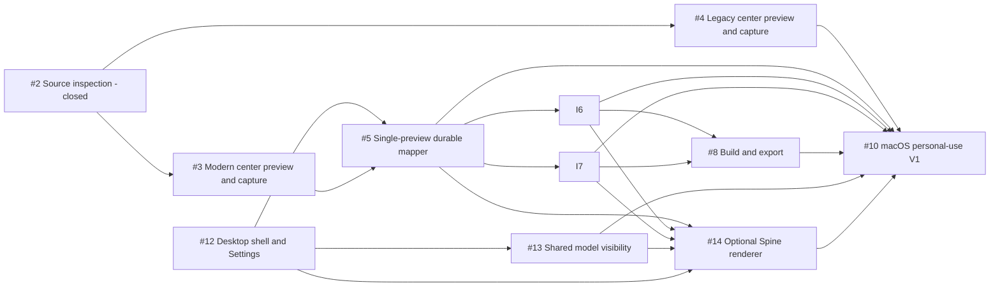

# Live2Pet Personal-Use V1 Implementation Plan

Status: Updated on 2026-09-03 — manual Live2D visibility and faster Desktop capture implemented; pre-Spine closeout in progress

## Outcome and boundary

The only current release outcome is a dependable personal-use macOS Desktop App that converts a permitted Live2D model folder, supported Live2D PCK file, or one supported Spine folder into a previewed, validated, downloadable Clawd or Codex ZIP, lets the user hide removable model backgrounds, and explicitly installs the generated package when the user chooses Install or Build & Install.

V1 does not include the official Cubism Web Framework integration, a Codex skill, Mapper Session, Windows qualification, signing, notarization, or public binary distribution. Only Windows and public distribution remain possible future milestones; the other removed product surfaces are not part of the current roadmap.

The center column of the three-column Mapper is the only user-visible Source Package preview in V1. A separate renderer process may remain as an internal crash-isolation or capture mechanism, but a separate preview window, its lifecycle controls, and parity work are not product outcomes and are removed from V1 acceptance.

Success is measured by one continuous desktop workflow: skippable first-run setup, Welcome, Source inspection, center-column Motion/Expression playback and model visibility in Map, direct target assignment, a terminal Package Build, generated-asset preview, ZIP download, and a user-triggered Install action. Runtime, optional renderer-pack, cache, and installation-destination configuration live in Settings rather than inside the project workspace. A missing Spine pack may also be downloaded through one inline action after Spine detection. Build and download must never install implicitly. The accepted workflow must contain zero prompts to choose between preview implementations and zero separate preview windows.

## Current baseline

The repository already contains:

- Live2D-folder and supported PCK inspection;
- versioned reference-only projects, recipes, separate target mappings, autosave, relinking, and review gates;
- Pixi-based modern and Cubism 2 adapters, an App-managed Desktop runtime library, and internal renderer isolation seams;
- Clawd and Codex target validators and builders;
- transparent WebP/atlas generation, build progress, cancellation, reports, and bounded caches;
- generated target previews, artifact download handles, and explicit post-build target installers;
- an Electron development shell and English/Simplified Chinese UI layer;
- a current-machine unsigned macOS App assembly command with packaged resource,
  Sharp/libvips, excluded-asset, and Mapper-window smoke checks;
- a shared CLI for build, validation, export, and explicit target-package installation; and
- release scans that exclude runtimes, models, copyrighted examples, and generated character packages.

The default development and packaged renderer now uses the HeroUI project shell. Setup, full-page Settings, native project operations, Source/Map/Build navigation, real embedded preview, durable mappings, history, recovery, and generated-package previews are connected to the existing App services. The legacy browser Mapper remains only a development reference. V1 adds two bounded renderer capabilities after this foundation: renderer-neutral Visual Settings for removable backgrounds and one isolated, optional Spine version line. Neither addition creates a second mapping UI or target build pipeline.

The current follow-up order is pre-Spine closeout first: target-host UI activation/playback acceptance (#6/#7), remaining build/report and explicit Build & Install checks (#8), then the non-Spine desktop accessibility review (#12). Manual Live2D Visibility (#13), hosted capture/cache wiring, and binary pixel transfer are implemented. Optional Spine (#14) has not started; its renderer-pack Settings and final Spine-inclusive release qualification remain later work. Default-renderer promotion alone does not close #12. Local real-model and performance evidence is documented in [Desktop acceptance](../desktop-acceptance.md).

The acceptance audit now completes #3, #4, and #5. The final packaged App passes
both real-model paths, both target builds, renderer-process crash/retry, project
recovery/relinking, and restart/reopen after the imported runtime files are moved.
These are completed preview/mapping slices, not target-host installation approval.
The shell dependency of #5 is delivered; unrelated remaining work in #12 does
not reopen the accepted mapping slice.

## Prioritized delivery sequence

### P0 — Establish the desktop App shell and Settings boundary

Issue: [#12](https://github.com/receyuki/live2pet/issues/12)

Outcome: a fresh or returning user sees an application lifecycle rather than a browser document, and App-global configuration no longer competes with project work.

Work:

1. Establish the React, TypeScript, and Vite production renderer with HeroUI v3 and its required Tailwind CSS v4 foundation. Use HeroUI as the only general-purpose component system.
2. Add a production App shell with platform title bar, application menu, compact toolbar, status bar, and Welcome versus Project states.
3. Provide Source, Map, and Build destinations that preserve one project and renderer session while changing the visible task surface.
4. Add a full in-window Settings destination with General, Runtimes, Targets & Installation, and Storage section navigation. Move the existing runtime, optional renderer-pack, and cache controls out of the project document and restore the previous project context when Settings closes.
5. Add a skippable full-page Setup Assistant that reuses Live2D runtime Settings, detects existing runtimes, supports one or both Cubism families, and remains available from Help. Do not download optional Spine support during first-run setup.
6. Persist locale, appearance, recent projects, reopen behavior, installation destinations, and window bounds as App settings; do not put them in `.live2pet`.
7. Add native Open, Save, Undo, Redo, Settings, and Build menu commands and shortcuts.
8. Replace hand-written standard controls with HeroUI components; keep custom presentation limited to the shell, three-column workspace, Live2D canvas and timeline, and restrained brand surfaces.
9. Remove landing-page headings, explanatory banners, duplicate global bars, and footer content from the packaged App navigation.

First review gate:

- run the real Electron App with representative non-copyrighted data;
- first validate a small HeroUI integration slice through Vite packaging and the Electron content security policy;
- review a runnable HeroUI preview of Welcome, full-page first-run setup, full-page Settings, the project toolbar, Source/Map/Build switching, and the three-column Map layout before migrating all working controls;
- review English and Simplified Chinese layout, keyboard focus, reduced motion, and both light and dark appearance; and
- do not commit generated UI concept artwork or model examples as product assets without a separate approval.

Acceptance gate:

- a clean profile shows the Setup Assistant once and a returning profile does not;
- an existing saved runtime is detected without reselection;
- setup can be deferred without blocking Source inspection;
- a missing matching runtime opens Settings at the correct entry and returns to the project after configuration;
- `Cmd+,`, Open, Save, Undo, Redo, and Build commands reach the correct App state; and
- App-global configuration is absent from Source, Map, and Build content;
- Settings is a full in-window destination rather than a modal or child window; and
- no second general-purpose component system or duplicate local primitive set is present in the production renderer.

### P0 — Make one preview-and-mapping flow dependable

Issues: [#3](https://github.com/receyuki/live2pet/issues/3), [#4](https://github.com/receyuki/live2pet/issues/4), [#5](https://github.com/receyuki/live2pet/issues/5)

Outcome: after a one-time runtime selection, the user can preview a modern or supported legacy Source Package in the center column, create an Animation Recipe, assign it, and resume the saved project without choosing or managing a second preview implementation.

Work:

1. Make the App-managed runtime library in Settings the sole runtime source of truth in Desktop mode, remove any second Mapper-managed runtime copy, and automatically select saved runtimes by inspected Cubism generation.
2. Keep modern production rendering on the existing Pixi adapter with user-provided official Cubism Core.
3. Keep Cubism 2 behind its legacy adapter and qualify the locally owned PCK fixture through the same visible preview controls.
4. Keep preview and capture in the center Map destination; do not maintain a separate preview window or its lifecycle API.
5. Complete center-column Motion/Expression controls, full-bounds framing, recoverable failure handling, and actionable mismatch errors.
6. Verify Motion-plus-Expression recipes, separate Clawd/Codex mappings, validation, undo/redo, keyboard operation, autosave, explicit save/reopen, and source relinking.
7. Keep the official Framework bridge out of the implementation.

Acceptance gate:

- one real standard modern model and the locally owned legacy PCK each pass import, reopen, center-column playback, mapping, and capture checks in the Desktop App;
- neither path asks for an already saved matching runtime again; and
- the accepted workflow exposes one visible source preview and no renderer-selection or separate-window controls;
- a real project saves and reopens with equivalent mappings and Render Presets;
- the right column always assigns the currently selected recipe; and
- no Source Package or runtime bytes are embedded.

### P0 — Share model visibility between preview and builds

Issue: [#13](https://github.com/receyuki/live2pet/issues/13)

Outcome: a user can hide a removable Live2D background once, retain useful character framing, and get the same visible result in the center preview and every generated package.

Work:

1. Extend the renderer contract with capability discovery, Visual Element listing, and atomic Visual Settings application without exposing Cubism-specific APIs to project or build packages.
2. Map Live2D Parts to stable Visual Element identities and reapply project-hidden Parts after animation and pose updates.
3. Add a searchable Visibility panel opened beside the center preview, temporarily replacing the Motion library to retain the three-column layout, with manual show/hide, transient Solo, and Restore all actions. Never hide elements based on naming heuristics.
4. Store hidden identities in the next `.live2pet` schema revision and migrate existing projects to an empty hidden set.
5. Compute framing from sampled visible animated bounds (nine poses per source Motion), restore the selected playback state afterward, and explain when a background shares an inseparable ArtMesh with the character. Sampling does not prove containment for every possible physics pose.
6. Include a canonical Visual Settings digest in capture-cache identity and pass the same settings through Clawd and Codex builds.

Acceptance gate:

- one permitted Live2D model can hide and restore a background Part in the center preview;
- save/reopen preserves the hidden identities but not temporary Solo state;
- visible framing and both generated targets exclude the same hidden content;
- animation playback cannot restore a project-hidden Part; and
- changing visibility invalidates only cache entries that depend on it.

### P0 — Prove both target packages in their hosts

Issues: [#6](https://github.com/receyuki/live2pet/issues/6), [#7](https://github.com/receyuki/live2pet/issues/7)

Outcome: both generated ZIP types pass internal validation, can be previewed from generated assets, and load in the pinned target host.

Clawd work:

1. Treat `idle`, `thinking`, `working`, and `sleeping` as the required V1 path.
2. Verify transparent WebP generation, `theme.json`, package-root shape, display size, and the 80-MiB rejection behavior.
3. Use the App's explicit post-build Install action for one locally generated ZIP and verify it in the pinned Clawd version.
4. Keep advanced sleep, fallbacks, reactions, tiers, idle pools, and roam available but non-blocking.

Codex work:

1. Verify all nine mapped rows, exact atlas geometry, transparent unused cells, deterministic sampling, and manifest shape.
2. Verify contact sheet and true-size playback use the generated atlas.
3. Use the App's explicit post-build Install action for one locally generated ZIP and verify it through the current Codex custom-pet workflow.

Acceptance gate:

- explicit post-build installation succeeds for both hosts without making build or download install implicitly;
- generated previews match the artifact rather than source playback; and
- any host mismatch is captured as a narrow compatibility fix, not a new framework project.

### P1 — Add one optional Spine renderer path

Issue: [#14](https://github.com/receyuki/live2pet/issues/14)

Outcome: a user with a supported Spine folder can explicitly install its optional renderer pack once, then use the same preview, visibility, mapping, build, download, and target-installation workflow as Live2D.

Work:

1. Detect a standard Spine folder with skeleton `.json` or `.skel`, `.atlas`, and referenced texture pages before any renderer download.
2. Select one pinned Spine `major.minor` line from a permitted real fixture; use the current official 4.3 line only when no fixture establishes another requirement, and reject mismatches actionably.
3. Add an optional renderer-pack service with a fixed exact-version HTTPS source, explicit user consent, byte limit, pinned integrity verification, atomic App-private installation, automatic reuse, and Settings removal.
4. Show one inline Download Spine Support action after a matching source is detected. Dismissal must preserve inspection and must not produce repeated modal prompts.
5. Run Spine in an isolated renderer realm. First test the official `spine-player` distribution; if deterministic stepping/capture is insufficient, use official `spine-pixi-v8` plus matching PixiJS behind the same internal adapter.
6. Implement the shared renderer contract for Motion playback, deterministic stepping, transparent RGBA capture, visible bounds, failure isolation, and Spine Slot visibility.
7. Reuse existing recipes and target builders. Keep Expressions empty for Spine and use the default skin in V1 rather than relabeling skins.
8. Add synthetic public tests and a permitted local fixture acceptance run without committing model or runtime artifacts.

Acceptance gate:

- Spine inspection works before optional-pack installation;
- download occurs only after a user click and the verified pack is reused after restart;
- one permitted real fixture passes center preview, mapping, Slot visibility, deterministic capture, and project reopen;
- that project builds and validates at least one Clawd package and one Codex Pet package; and
- an unsupported version and failed integrity check each provide actionable recovery without losing project state.

### P1 — Harden build, cache, progress, download, and installation

Issue: [#8](https://github.com/receyuki/live2pet/issues/8)

Outcome: long builds are understandable, cancellable, reusable, and always end in a clear terminal state with a portable artifact that the user can explicitly install.

Work:

1. Move both target builders into the Build destination and verify named stages, percentage progress, terminal success/failure/cancelled state, and build-control reset.
2. Keep renderer capture concurrency bounded; parallelize safe independent encoding/assembly only where measurements show a benefit.
3. Verify unchanged rebuilds use integrity-checked capture and WebP cache entries.
4. Verify cancellation and failure clean staging data and never expose a partial artifact.
5. Verify reports, path redaction, safe artifact naming, generated preview, and explicit ZIP download.
6. Verify a separate post-build Install action and explicit Build & Install command for each target, including success, actionable failure, and safe handling of an existing installed package.
7. Keep a 5-GiB cache policy outside V1 acceptance.

Acceptance gate:

- both targets finish with a visible terminal state and downloadable ZIP;
- each validated package installs into its selected target host only after the user explicitly chooses Install;
- a cancelled build can be followed immediately by a successful build;
- an unchanged rebuild reports cache hits and avoids equivalent capture work; and
- builds do not install or overwrite artifacts implicitly.

### P1 — Package and accept the personal-use macOS App

Issue: [#10](https://github.com/receyuki/live2pet/issues/10)

Outcome: the user can launch a local macOS App and complete the entire workflow without development commands after the App has been built.

Work:

1. Produce and smoke-test the current-machine macOS App bundle with packaged renderer assets and native image dependencies.
2. Run the first-launch, deferred-setup, Settings, modern, legacy, visibility, optional Spine, both-target, cancellation, restart, and runtime-reuse acceptance scenarios from the V1 specification.
3. Complete the required English/Chinese, keyboard, focus, contrast, reduced-motion, progress-announcement, and error-state review.
4. Verify the project window remains usable at the supported minimum size and restores its previous bounds.
5. Run dependency, source-release, path/privacy, and excluded-asset scans.
6. Write a short personal-build/run guide that clearly separates local use from public signed binary release.

Acceptance gate:

- a clean macOS user profile completes import through ZIP download and explicit installation for both targets;
- no system codec tool is required;
- all P0/P1 issues are closed with test or manual acceptance evidence; and
- the public binary release gate remains explicitly separate.

## Dependency graph

[#11](https://github.com/receyuki/live2pet/issues/11) is post-V1 and is not on this dependency graph. #9 is closed as removed scope rather than carried as a hidden product surface.

## Issue status policy

| Issue | V1 role | Close when |
| --- | --- | --- |
| #2 Source inspection | Complete | Already closed |
| #12 Desktop shell | P0 | First-run, Settings, Welcome, and Source/Map/Build navigation pass the real App review |
| #3 Modern preview | Complete | Accepted with saved-runtime playback, capture, restart, and crash recovery |
| #4 Legacy preview | Complete | Accepted with real PCK playback, both builds, restart, and crash recovery |
| #5 Durable mapper | Complete | Accepted with direct assignments, save/reopen, review, recovery, and relinking |
| #13 Model visibility | P0 | Hidden Live2D Parts persist and match preview, visible bounds, cache identity, and both builds |
| #6 Clawd package | P0 | Core-state ZIP imports into pinned Clawd |
| #7 Codex package | P0 | Nine-row ZIP loads in Codex |
| #14 Optional Spine renderer | P1 | One pinned Spine line completes preview, visibility, capture, and both target builds after an explicit verified download |
| #8 Build/export | P1 | Progress, cancel, cache, preview, download, and explicit install pass |
| #10 macOS V1 | Final | Clean-profile full workflow passes |
| #9 Codex skill/session | Removed scope | Close after the unused implementation and documentation are removed |
| #11 Windows x64 | Post-V1 | Reprioritize after macOS V1 |

An issue closes when its observable acceptance evidence exists, even if optional polish or post-V1 capability remains. Follow-up work becomes a narrower issue instead of keeping a broad issue open indefinitely.

## Verification matrix

| Surface | Automated evidence | Local acceptance evidence |
| --- | --- | --- |
| Source inspection | Synthetic standard/PCK contracts and malformed-input tests | Owned modern model and Live2D PCK file |
| Runtime library | Validation, persistence, generation selection, clear/replace tests | Restart and reopen without reselection |
| Desktop shell | First-run state, Settings ownership, menu routing, destination-state, and window-bounds tests | Clean-profile setup and returning-project flow |
| Renderer | Shared deterministic playback/capture contract and failure-recovery tests | Center-column Motion/Expression playback on both generations |
| Visual Settings | Contract, project migration, animation reapply, visible-bounds, and cache-identity tests | Hide a Live2D background and compare preview with both generated targets |
| Optional Spine pack | Consent, fixed-version, size, integrity, atomic-install, reuse, removal, and mismatch tests | Permitted Spine fixture through preview, Slot visibility, mapping, and both target builds |
| Project/mapper | Schema, save/recovery, relink, mapping validation tests | Electron save/reopen and keyboard flow |
| Clawd | Synthetic manifest/WebP/size/package validation | Import into pinned Clawd version |
| Codex | Synthetic atlas/manifest/transparency validation | Load through current custom-pet workflow |
| Build service | Progress, cancel, cache, path-redaction, artifact, and explicit-install tests | Repeat build, ZIP download, and user-triggered installation into both hosts |
| macOS App | Bundle launch and packaged-dependency smoke | Clean-profile end-to-end run |

## Deferred backlog

- [#11](https://github.com/receyuki/live2pet/issues/11): Windows x64 qualification.
- Public signed/notarized installers and update channel.
- Large configurable cache policy and cache-management UI beyond current bounded controls.
- Advanced Clawd behavior as mandatory target-host acceptance.
- Multi-window projects, panel docking, and a separate public browser workflow.
- Multiple Spine runtime lines, advanced skin/attachment authoring, and unsupported Spine containers.

## Definition of done for V1 implementation issues

1. The issue stays within the V1 scope above.
2. Observable acceptance criteria are covered by automated tests where practical.
3. Any real-runtime or target-host evidence is recorded without committing proprietary inputs.
4. `pnpm test`, `pnpm typecheck`, and `pnpm release:check` pass for implementation changes.
5. English documentation and affected Simplified Chinese UI messages are updated.
6. No runtime, model, generated character package, secret, token, or unrelated absolute path is introduced.
7. The Issue body and native GitHub dependencies match the actual remaining work.

The desktop information architecture is recorded in ADR-0012, the HeroUI
interface foundation is recorded in ADR-0013, and optional Spine plus shared
Visual Settings are recorded in ADR-0014. The first UI review uses the
production Electron shell with synthetic representative data, not a separate
throwaway browser prototype.
